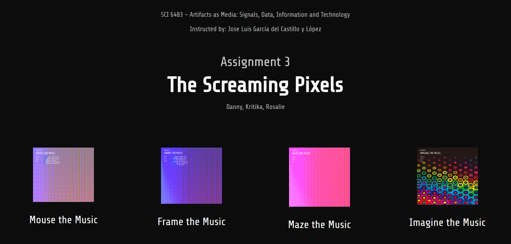
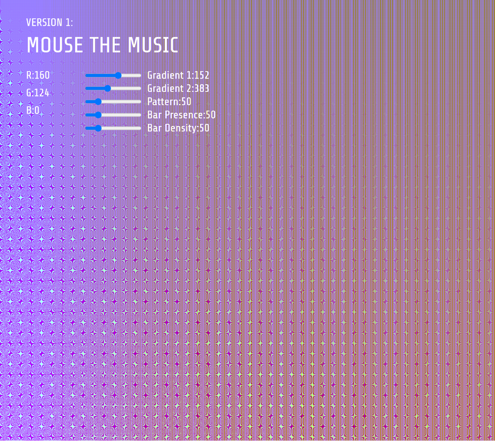
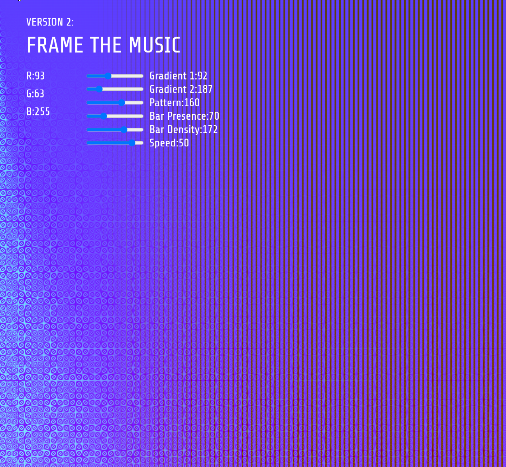
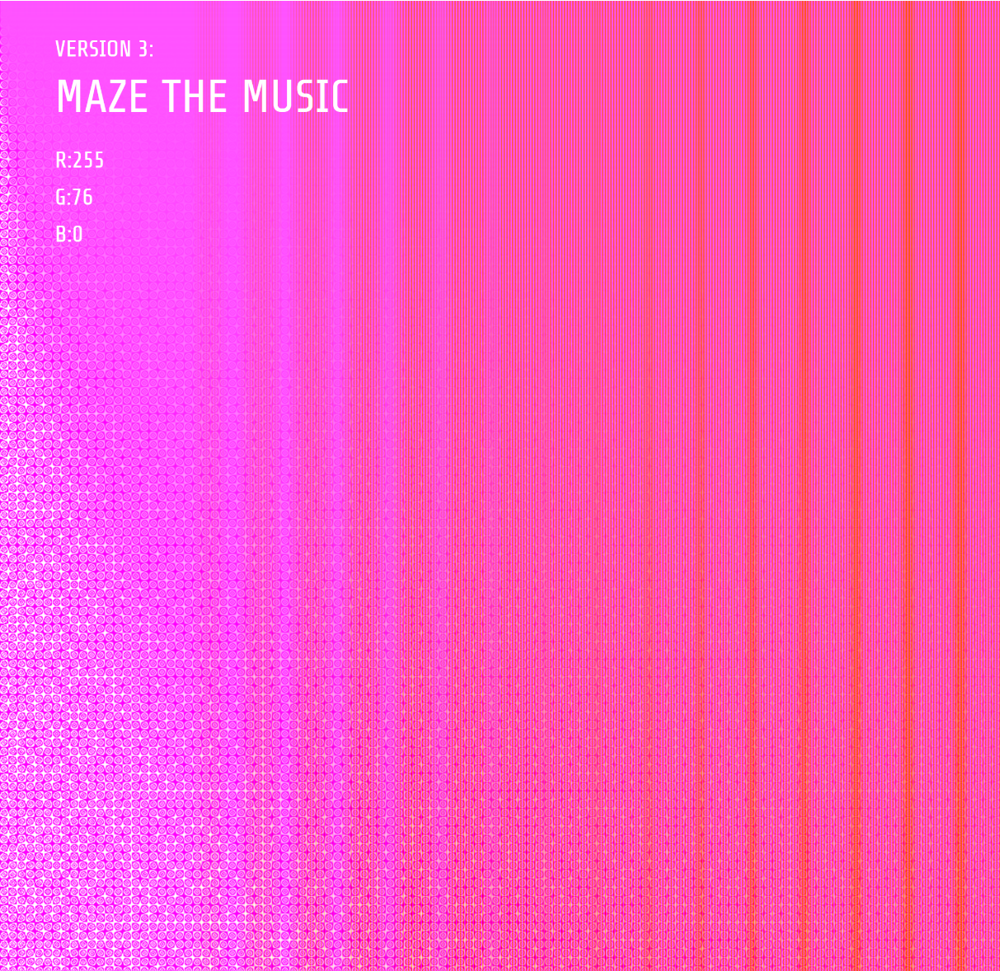
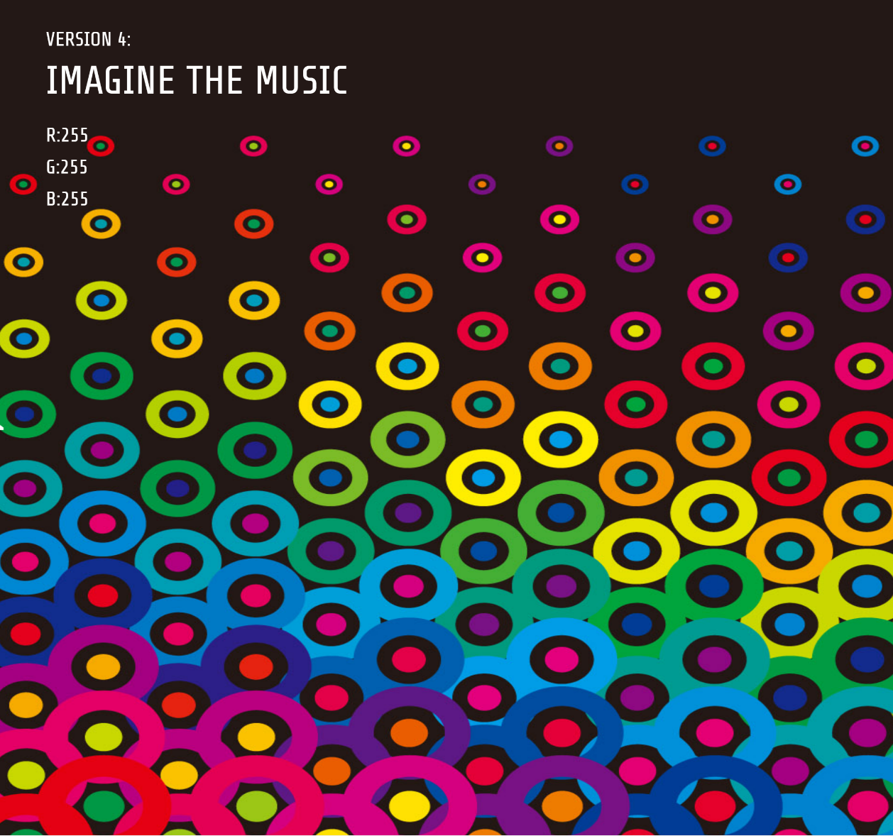

# The Screaming Pixels: An Exploration of Sound Synthesis Through Image Sonification Using p5js. 
This project was created by Danny Clarke, Kritika Kharbanda, and Rosalie Lin for SCI 6483 - Artifacts as Media: Signals, Data, Information and Technology instructed by Jose Luis García del Castillo y López during the Spring 2022 semester at Harvard Graduate School of Design. 

This project utilizes the p5.js library to create an interactive program that generates visual patterns to drive sound synthesis.

This project marks the beginning of explorations in image sonification techniques. 

## Features

- Generates visually appealing patterns using UI sliders.
- Maps pixel values of an image to control the frequencies of oscillators for sound generation.
- Interactive controls for starting and stopping the sound.
- Ability to save the generated image.

## Installation

1. Clone the repository or download the source code files.
2. Install Visual Studio Code: Visit https://code.visualstudio.com.
3. Download the installer: Click on the appropriate download button for your operating system (Windows, macOS, or Linux).
4. Install the Live Server extension: Open Visual Studio Code, go to the Extensions view (by clicking on the square icon in the sidebar on the left or by pressing Ctrl+Shift+X), search for "Live Server" in the marketplace, and click "Install" to install the extension.
5. Open your project folder: Open the folder that contains your index.html file in Visual Studio Code. You can do this by selecting "File" from the top menu and choosing "Open Folder" or by dragging the folder into the Visual Studio Code window.
6. Open index.html: Locate and open your index.html file in the editor.
7. Start the Live Server: Right-click anywhere inside the index.html editor window (or use the context menu by pressing Ctrl+Right Click on Windows/Linux or Cmd+Right Click on macOS), and select "Open with Live Server" from the options. Alternatively, you can use the shortcut Alt+L followed by Alt+O.
8. Launch the webpage: The Live Server extension will launch a new browser window/tab automatically, displaying The Screaming Pixels index.html page.
9. Select one of the four options:
  - Mouse The Music
  - Frame The Music
  - Maze The Music
  - Imagine the Music

A new page will open for each option. 

## Usage

- Upon running the program, a canvas will appear displaying the generated visual pattern.
- The frequency of sound generated by the oscillators is influenced by the pixel values of the image.
- Interact with the program using the following controls:
  - Mouse:
    - Clicking within the top-left area (400x300 pixels) stops the sound.
    - Clicking elsewhere toggles the sound on or off.
  - Keyboard:
    - Press the 's' or 'S' key to save the current frame as an image (PNG format).

## Customization

- You can modify the code to customize various aspects of the program, such as:
  - Loading a different image: Replace the `src` variable with the desired image or modify the image generation functions.
  - Adjust oscillator frequencies and types: Modify the `osc.freq()` and `osc.setType()` statements to change the sound characteristics.
  - Modifying visual elements: Alter the size, color, and position of graphical elements in the `draw()` function.

## Dependencies

This project relies on the following dependencies:
- p5.js: A JavaScript library for creative coding.

## Credits

This project is developed using the p5.js library, which is created by the Processing Foundation. For more information about p5.js, visit the [p5.js website](https://p5js.org/).

## License

This project is licensed under the [MIT License](LICENSE). Feel free to use, modify, and distribute the code for personal or commercial purposes.

## Acknowledgements

The code and project structure are inspired by various examples and tutorials provided by the p5.js community.

## Code Descriptions

## Mouse The Music: sketch_v1_mouseHover.js  

This code sets up a canvas and allows users to manipulate sliders to generate an image with changing colors and patterns, while also producing musical tones based on the color values of the mouse cursor within the image.
  
  - It declares and initializes variables, including sliders and oscillators, which will be used for controlling various parameters.      
  - The setup() function is called once at the beginning to set up the canvas, create sliders, and initialize oscillators.     
  - The draw() function is called repeatedly in a loop. Within this function:      
  - The values from the sliders are obtained to control the colors and patterns.     
  - An image is generated using the mathPatternDanny() function, passing in the canvas width, height, and the slider values.      
  - The image is used as the background for the canvas.       
  - The position and color values of the mouse cursor within the image are obtained.      
  - The frequency of the oscillators (osc, osc2, osc3) is adjusted based on the color values, creating a musical effect.     
  - Various text elements are displayed on the canvas to provide visual feedback.      
  - The mousePressed() function is called when a mouse button is pressed. Depending on the position of the cursor, the oscillators are stopped or started.      
  - The keyPressed() function is called when a key is pressed. If the key is 's' or 'S', the current canvas image is saved as a PNG file.
    
## Frame The Music: sketch_v2_frameLoop_basic.js

This code sets up a canvas with user interface elements for controlling visual and audio effects. It generates and displays processed images based on user-adjustable sliders and uses pixel values to control the frequency of three oscillators. 

The code iterates over the image pixel array in a sequential manner, incrementing the imageIndex by 4 to move to the next pixel's values.

The code uses three oscillators (osc, osc2, and osc3) to generate sound based on the pixel values of the generated image. Specifically, it maps the red, green, and blue channel values of a specific pixel to the frequency of each oscillator. 

  - The code uses an imageIndex variable to traverse the image's pixel array.    
  - The oscillators generate sound based on the mapped pixel values, creating an audio representation of the image.    
  - Within the draw() function, it retrieves the RGB values of a specific pixel using imageIndex.    
  - These RGB values are mapped to desired frequency ranges for three oscillators (osc, osc2, and osc3).    
  - The frequencies of the oscillators are set based on the mapped values.         
  - The imageIndex is incremented to move to the next pixel's values, and the sound is updated accordingly.    
  - This process repeats for each pixel in the image, allowing the image to control the sound synthesis.

## Maze The Music: sketch_v3_frameLoop_mazeBoundary.js

The program employs a random walker algorithm to traverse through the pixels of the image. As the walker moves, it highlights each visited pixel. The RGB values of the highlighted pixel are mapped to oscillator frequencies, generating sound based on the image content. Three oscillators (osc, osc2, and osc3) are utilized, each assigned to a specific color channel (red, green, and blue) respectively.

The program includes UI text that presents information about the RGB values of the current highlighted pixel. Users can interact with the visualization by clicking on the canvas to toggle the sound on and off. Additionally, pressing the 's' or 'S' key enables users to save the current frame as an image.

## Imagine The Music: sketch_v4_customImage.js

The program employs a random walker algorithm to traverse through the pixels of the image. As the walker moves, it highlights each visited pixel. The RGB values of the highlighted pixel are mapped to oscillator frequencies, generating sound based on the image content. Three oscillators (osc, osc2, and osc3) are utilized, each assigned to a specific color channel (red, green, and blue) respectively.

The program includes UI text that presents information about the RGB values of the current highlighted pixel. Users can interact with the visualization by clicking on the canvas to toggle the sound on and off. Additionally, pressing the 's' or 'S' key enables users to save the current frame as an image.

It begins by loading an image file specified in the preload() function. To use a different image, simply replace the 'asset/apple.jpg' file path with the desired image file. The loaded image is then displayed on a fullscreen canvas.

To use a different image:

1. Replace the file path in the preload() function with the path to your desired image file.
2. Make sure the image file is stored in the correct location relative to the code.

    
